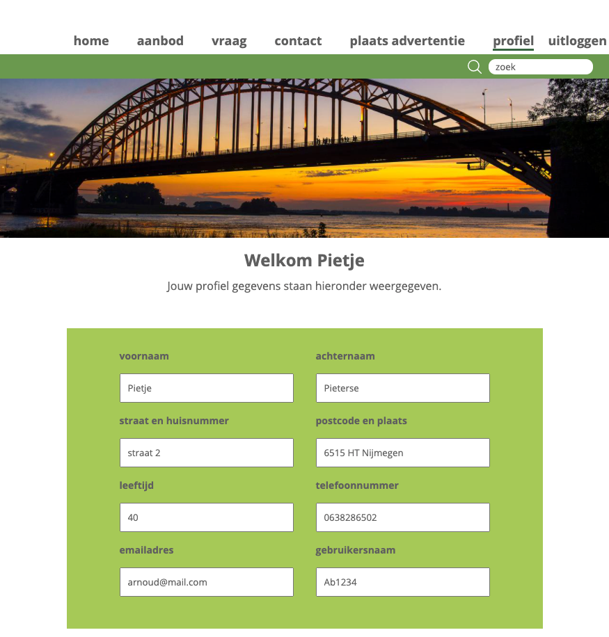

# Inhoudsopgave
1. Inleiding
2. Lijst met benodigdheden
3. Installatie handleiding
4. Testen
5. Inloggegevens en hoe te registreren
6. Scripts NPM

# Inleiding
Dit document beschrijft de website voor “Sociaal Oosterhout”.
Het doel van deze website is om mensen uit de wijk met **postcode 6515** in Nijmegen-Noord met elkaar in contact te brengen om een mogelijk sociaal isolement en vereenzaming te voorkomen.
In deze tijden van corona is het juist belangrijk dat er een sociaal vangnet blijft voor mensen die dit nodig hebben.
Buurthuizen, haak clubjes, breiclubjes, biljartclub, etcetera moeten sluiten of mogen maar een beperkt aantal mensen ontvangen. Het gevolg is dat mensen thuis zitten en dat het sociaal netwerk kleiner wordt en mensen vereenzamen.
Dit project gaat dan ook over een applicatie die gericht is op een woonwijk, waar buurtgenoten de mogelijkheid hebben om met elkaar in contact te komen en elkaar te leren kennen.

Home:


Profielpagina:


Het project is opgezet met  [Create React App](https://github.com/facebook/create-react-app).

# Lijst met benodigdheden
1. Node.js _(versie v12.18.4 of hoger)_
2. NPM
3. Git
4. Google account

# Installatie handleiding
1. Clone de git repository. 
2. Installeer de node_modules door het volgende commando in de terminal te runnen:

_npm install_

3. Configureer de API-keys voor firebase.
   De API-keys zijn in een .env bestand geplaatst en dus afgeschermd.
   - Maak een .env bestand aan in de root van het project.
   - Voeg de volgende key-values toe aan het .env bestand.
    
```text
REACT_APP_API_KEY= your API-key here
REACT-APP_API-ID= your API-id here
REACT_APP_API_MSG= your API-msg here
```

- De benodigde keys zijn meegestuurd als bijlage _(REPO-and-API-Bouman)_ bij dit project.
  

4. Applicatie starten door het volgende commando in de terminal te runnen:

_npm start_

of gebruik de WebStorm knop (npm start). 

Open http://localhost:3000 om de applicatie in de browser te bekijken.

### Testen
De unit testen zijn te vinden in de map: Tests/Register.test.js

De testen zijn uit te voeren door het volgende commando in de terminal te runnen.

_npm run test_

# Inloggegevens en hoe te registreren
* Voor deze applicatie is gebruik gemaakt van Firebase en de Firebase Firestore Database. Je hebt geen inlog gegevens of wachtwoord nodig.
* Via de registratiepagina kun je zelf een profiel aanmaken. Zgn _admin_ gegevens zijn niet nodig.
* De registratie kan alleen lukken als de postcode **6515** wordt gebruikt bij het inputveld voor postcode en woonplaats.
* Na registratie wordt je automatisch doorgelinkt naar je profiel pagina.
* Zodra je bent geregistreerd of ingelogd kun je een advertenties plaatsen.

# Scripts NPM
- "start": Dit start het project in development mode.
- "build": Maakt een geoptimaliseerd JavaScript, HTML en CSS bestand voor productie.
- "test": Voert de unit testen uit.
- "eject": Maakt alle configuratie zichtbaar zodat je die zelf kunt aanpassen.

