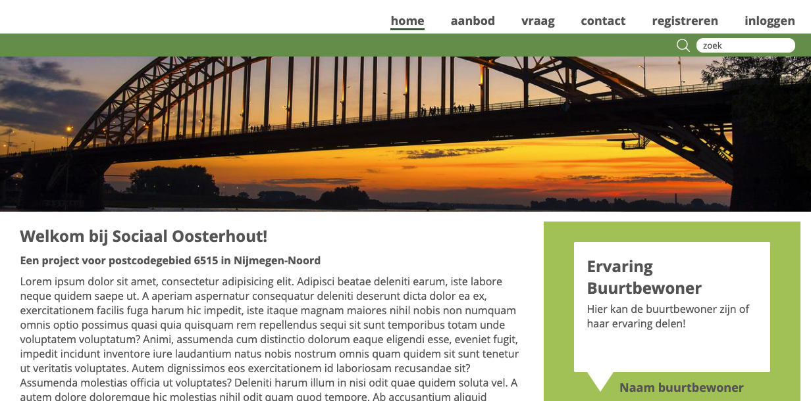

# Inleiding
Dit document beschrijft de website voor “Sociaal Oosterhout”.
Het doel van deze website is om mensen uit de wijk met **postcode 6515** in Nijmegen-Noord met elkaar in contact te brengen om een mogelijk sociaal isolement en vereenzaming te voorkomen.
In deze tijden van corona is het juist belangrijk dat er een sociaal vangnet blijft voor mensen die dit nodig hebben.
Buurthuizen, haak clubjes, breiclubjes, biljartclub, etcetera moeten sluiten of mogen maar een beperkt aantal mensen ontvangen. Het gevolg is dat mensen thuis zitten en dat het sociaal netwerk kleiner wordt en mensen vereenzamen.
Dit project gaat dan ook over een applicatie die gericht is op een woonwijk, waar buurtgenoten de mogelijkheid hebben om met elkaar in contact te komen en elkaar te leren kennen.



Het project is opgezet met  [Create React App](https://github.com/facebook/create-react-app).

# De applicatie starten
Als het project gecloned is naar jouw computer, installeer je eerst de node_modules door het volgende commando in de terminal te runnen:

_npm install_

Wanneer dit klaar is, kun je de applicatie starten met behulp van:

_npm start_

of gebruik de WebStorm knop (npm start). 

Open http://localhost:3000 om de applicatie in de browser te bekijken.

### API-keys
De API-keys zijn in een .env bestand geplaatst en dus afgeschermd.
Na het opstarten van het project moeten de API keys toegevoegd worden. De afgeschermde API-keys staan in de folder: modules/Firebase.js
```text
    apiKey: your API KEY here,
    authDomain: "eind-opdracht-novi.firebaseapp.com",
    projectId: "eind-opdracht-novi",
    storageBucket: "eind-opdracht-novi.appspot.com",
    messagingSenderId: your API MSG here,
    appId: your API ID here
```
De benodigde keys zijn meegestuurd als bijlage bij het project.

### Testen
De unit testen zijn te vinden in de map: Tests die te vinden is in de src folder.
De testen zijn te runnen door het volgende commando in de terminal te runnen.

_npm run test_

# Stappenplan
* Voor deze applicatie is gebruik gemaakt van Firebase en de Firebase Firestore Database. Je hebt geen inlog gegevens of wachtwoord nodig.
* De registratie kan alleen lukken als de postcode **6515** wordt gebruikt. 
* Via de registratiepagina kan je zelf een profiel aanmaken.
* Na registratie wordt je automatisch doorgelinkt naar je profiel pagina.
* Zodra je bent geregistreerd of ingelogd kun je een advertenties plaatsen.

